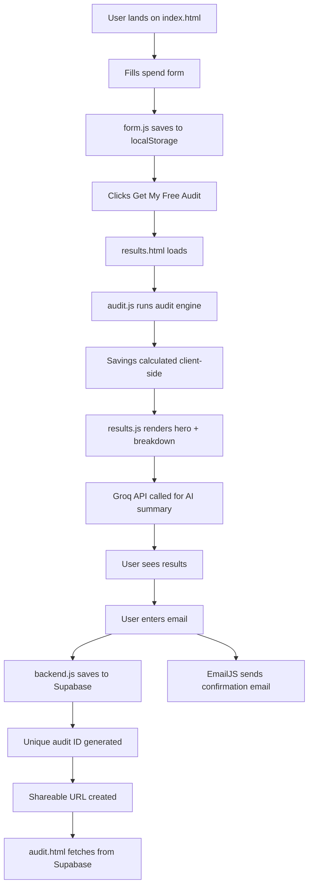

# Architecture

## System Diagram

## Data Flow

1. User fills form → saved to localStorage instantly
2. On submit → localStorage data passed to results page
3. audit.js reads localStorage → runs pure JS audit functions
4. Results rendered entirely client-side — no server needed
5. User submits email → backend.js POSTs to Supabase REST API
6. EmailJS sends confirmation directly from browser
7. Unique UUID generated → stored as audit ID in Supabase
8. Shareable URL = spendaudit.netlify.app/audit.html?id=UUID
9. audit.html fetches audit data from Supabase by ID

## Why I Chose This Stack

**Vanilla JS over React/Next.js:**
Chosen for shipping speed given a 7-day timeline. Zero build
tooling means faster iteration, simpler debugging, and instant
Netlify deployment with no configuration. The assignment rewards
shipping over framework sophistication.

**Supabase over Firebase:**
Better free tier limits, real SQL (Postgres), cleaner REST API
that works with plain fetch() without any SDK. Row-level security
available for future use.

**EmailJS over Resend/Postmark:**
Resend and Postmark cannot be called directly from browsers due
to CORS restrictions — they require a server-side proxy. EmailJS
is purpose-built for browser-side email sending with no backend
needed.

**Groq over OpenAI:**
Free tier available, extremely fast inference (LLaMA3), sufficient
quality for 100-word audit summaries.

**Netlify over Vercel:**
Simpler deployment for vanilla HTML/JS projects. No framework
detection needed. Drag-and-drop or GitHub auto-deploy both work
seamlessly.

**Client-side audit logic:**
The audit engine is intentionally pure JavaScript with no AI
involvement. Hardcoded rules are deterministic, auditable, and
defensible to a finance person. AI is only used for the
personalized summary paragraph — not for the financial logic.

## What I Would Change For 10,000 Audits Per Day

1. Move API keys server-side using Netlify Functions
2. Add Redis caching for audit results (same tool combos repeat)
3. Add a job queue for email sending instead of synchronous calls
4. Add Postgres indexes on email and created_at columns
5. Add rate limiting per IP on the audit submission endpoint
6. Use a CDN for static assets (already handled by Netlify)
7. Add monitoring with Sentry for error tracking
8. Split audit.js into separate modules per tool for maintainability